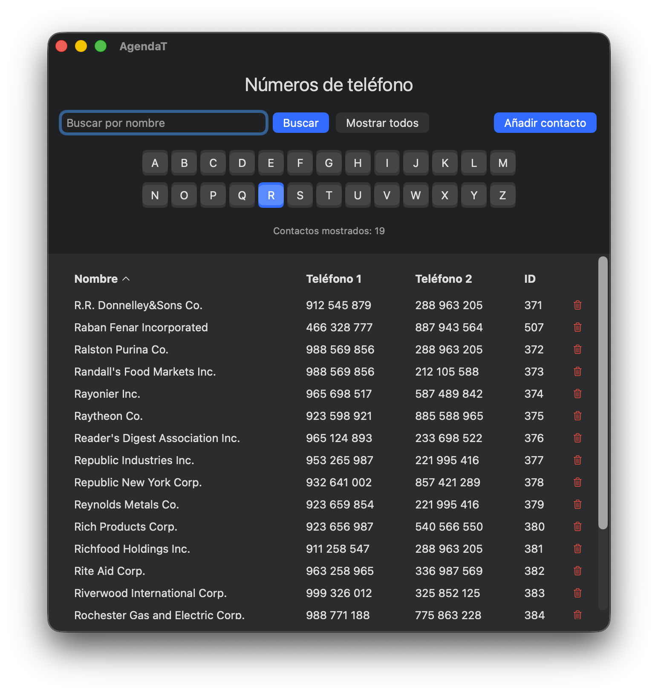

# AgendaT - Aplicación sencilla de agenda telefónica


[README en inglés](README.md)

AgendaT es una aplicación sencilla de agenda telefónica, desarrollada con SwiftUI y diseñada para macOS 13 (Ventura) y versiones posteriores. La aplicación permite explorar, buscar y editar fácilmente los contactos de teléfono almacenados en un archivo XML.

Más que una aplicación para uso real (aunque funciona bien), debería considerarse un ejercicio para aprender SwiftUI y cómo manejar archivos XML como fuente de datos para un conjunto de datos.



## Características

- **Fuente de datos XML**: Las entradas de la agenda se almacenan en un archivo XML con cuatro subelementos:
	- Nombre
	- Teléfono 1 (sólo numérico)
	- Teléfono 2 (sólo numérico)
	- ID (clave numérica única, no puede ser nula)
- **Ordenación por varias columnas**: Haga clic en los encabezados de columna para ordenar por nombre, número de teléfono o ID.
	- Alternar entre orden ascendente y descendente.
	- Indicadores visuales que muestran el campo de ordenación actual y la dirección.
- **Visualización en cuadrícula**: Muestra las entradas en una cuadrícula LazyVGrid con el título "Números de teléfono".
- **Función de búsqueda**:
	- Búsqueda de texto por nombre (admite coincidencias parciales).
	- La búsqueda se aplica al pulsar el botón "Mostrar".
	- 26 botones con letras del alfabeto para filtrar por primera letra.
	- Botón "Borrar filtros" para restablecer todos los filtros y mostrar todos los registros.
- **Funciones de edición**:
	- Agregar nuevos contactos. Con identificadores autogenerados
	- Edita los contactos existentes haciendo clic en su nombre
	- Elimina contactos con el icono de la papelera (se requiere confirmación)
	- Los cambios se guardan en un archivo XML en el directorio de documentos
- **Contador de registros**: Muestra el número de registros visibles actualmente

## Almacenamiento en el directorio de documentos

Los contactos se guardan en un archivo XML:

`~/Library/Containers/perez987.AgendaT/Data/Documents/Phonebook.xml`

Puedes transferir tus datos copiando este archivo a otro equipo y ejecutando la aplicación AgendaT en él.

## Estructura del proyecto

```
AgendaT/
├── AgendaTApp.swift              # Punto de entrada principal de la aplicación
├── AppDelegate.swift             # Delegado de la aplicación
├── AgendaT.entitlements          # Permisos y capacidades de la app
├── Assets.xcassets/              # Iconos y recursos visuales de la app
│   ├── AccentColor.colorset/
│   └── AppIcon.appiconset/
├── Models/
│   ├── FilterSortManager.swift   # Lógica de filtrado y ordenación
│   ├── LocalizationManager.swift # Detección de idioma y traducción
│   ├── PhoneEntry.swift          # Modelo de datos para las entradas de teléfono
│   ├── PhonebookManager.swift    # Gestión de datos de la agenda
│   └── XMLParser.swift           # Funcionalidad de análisis XML
├── Resources/
│   ├── Phonebook.xml             # Archivo de datos XML de ejemplo con entradas de teléfono
│   ├── en.lproj/                 # Traducción al inglés
│   ├── es.lproj/                 # Traducción al español
│   └── fr.lproj/                 # Traducción al francés
└── Views/
    └── ContentView.swift         # Vista principal de la interfaz de usuario
```

## Requisitos

- macOS 13.0 o posterior
- Xcode 15.0 o posterior
- Swift 5.0 o posterior

## Compilación

Abre `AgendaT.xcodeproj` en Xcode y compila el proyecto.

