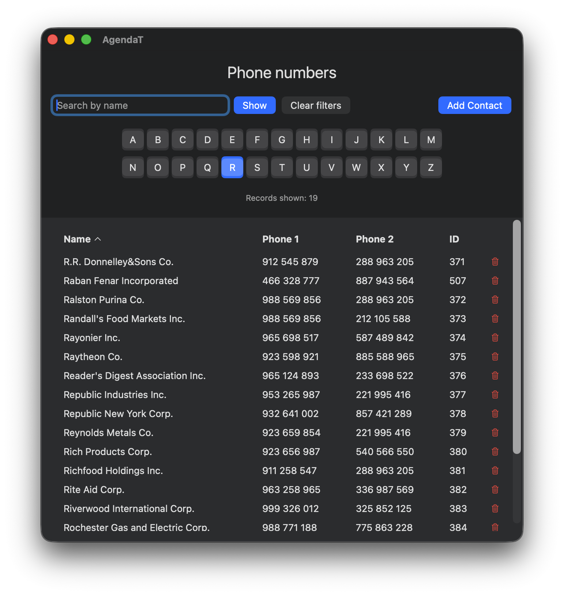

# AgendaT - Simple Phonebook Application

[README in Spanish](README-ES.md)

AgendaT is a lightweight phonebook application built with SwiftUI, designed for macOS 13 (Ventura) and later. The application provides a simple way to browse, search and edit phone contacts stored in an XML file.

More than an app for real use (although it works well), it should be seen as an exercise to learn SwiftUI and how to handle XML files as a data source for a dataset.

## Features

- **XML Data Source**: Phone book entries are stored in an XML file with four sub-elements:
  - Name
  - Phone 1 (numeric only)
  - Phone 2 (numeric only)
  - ID (unique numeric key, non-null)

- **Multi-Column Sorting**: Click column headers to sort by name, phone numbers, or ID
  - Toggle between ascending and descending order
  - Visual indicators show current sort field and direction

- **Grid Display**: Shows entries in a LazyVGrid with the title "Phone numbers"

- **Search Functionality**:
  - Text search by name (partial match supported)
  - Search is applied when "Show" button is pressed
  - 26 alphabet letter buttons for filtering by first letter
  - "Clear filters" button to reset all filters and display all records

- **Edit Capabilities**:
  - Add new contacts with auto-generated IDs
  - Edit existing contacts by clicking on contact name
  - Delete contacts with trash icon (confirmation required)
  - Changes persist to XML file in documents directory

- **Record Counter**: Displays the number of currently visible records

## Documents directory storage
  
Contacts are saved in a XML file:

`~/Library/Containers/perez987.AgendaT/Data/Documents/Phonebook.xml`

You can bring your data by copying this file to a different machine and running AgendaT app on it.

## Project Structure

- `AgendaTApp.swift` - Main application entry point
- `ContentView.swift` - Main UI view with grid, search, and filter controls
- `PhoneEntry.swift` - Data model for phone entries
- `XMLParser.swift` - XML parsing functionality
- `phonebook.xml` - Sample XML data file with phone entries

## Requirements

- macOS 13.0 or later
- Xcode 15.0 or later
- Swift 5.0 or later

## Building

Open `AgendaT.xcodeproj` in Xcode and build the project.
